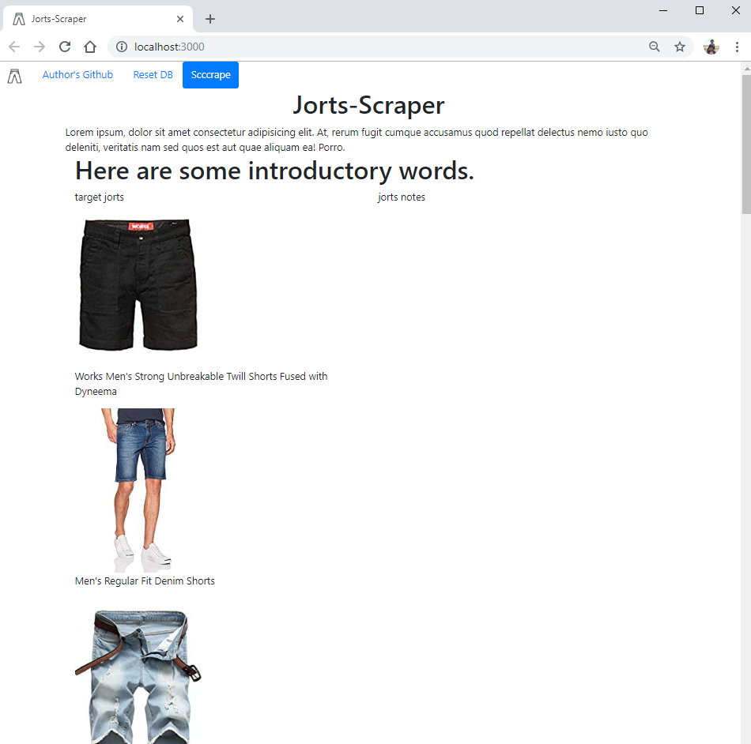

# Jorts-Scraper
This application scrapes information from Amazon's list of search results for jorts(or jean-shorts) and stores a picture and title of each listed item in a MongoDB collection. CURRENTLY IN MAINTENANCE

## Highlighted Technology Impplemented in this Project
- Express (https://www.npmjs.com/package/express)
- Axios (https://www.npmjs.com/package/axios)
- Cheerio (https://www.npmjs.com/package/cheerio)
- Mongoose (https://www.npmjs.com/package/mongoose)
- Request (https://www.npmjs.com/package/request)

## Purpose of this Project
This project was an exercise in using scraping tools and navigating through HTML with JQuery Selectors. The biggest challenges in this (WHICH HAS YET TO BE SOLVED) is updating items with notes and uploading to Heroku while utilizing mLab to store my Collection.

### Where I Would Like this Project to Go
- I would like to expand the scraping functionality to take text input, search amazon with it, and scrape that relevant information.
- Notes currently do not submit so I would like that issue to be taken care of.
- The project is uploaded to Heroku (https://jort-scraper.herokuapp.com/) but currently is not correctly configured to store NoSQL Mongo collections on mLab and should be fixed.